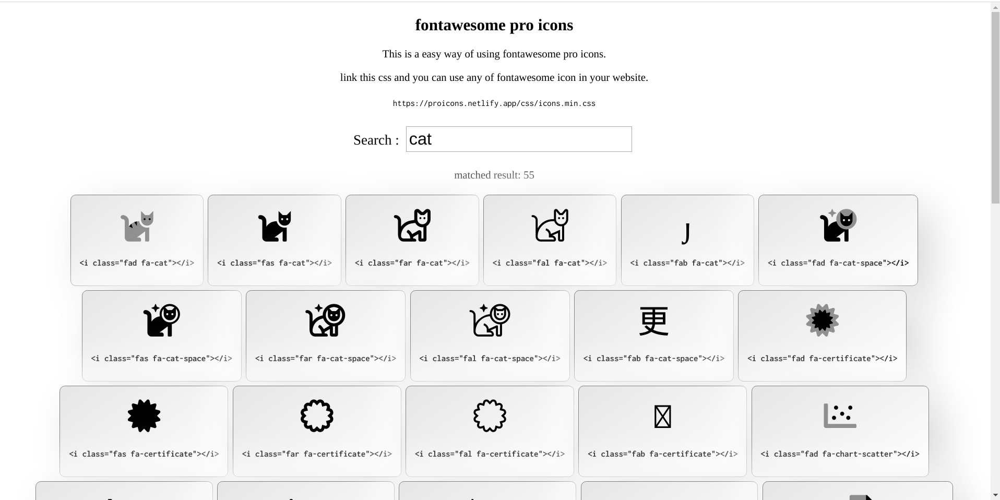

# FontAwesome Pro Icons
This is the easy way of using any of Fontawesome icons(`Including Pro Icons`) on your website easily.

just link the CSS which I found on [proicons.netlify.app/](https://proicons.netlify.app/) and then you can use any of the icons on your website easily as you can use the real Fontawesome icons.

#### like:
```
<link rel="stylesheet" href="https://proicons.netlify.app/css/icons.min.css">
```



>visit the website [here](https://proicons.netlify.app/)

### Here is the example code
```
<!DOCTYPE html>
<html>

  <head>
    <link rel="stylesheet" href="https://proicons.netlify.app/css/icons.min.css">
  </head>

  <body>
    <i class="far fa-10x fa-cat-space"></i>
  </body>

</html>

```
